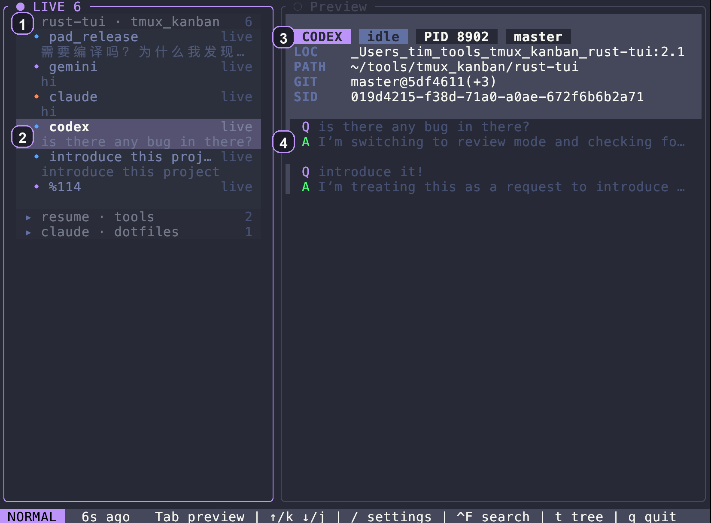
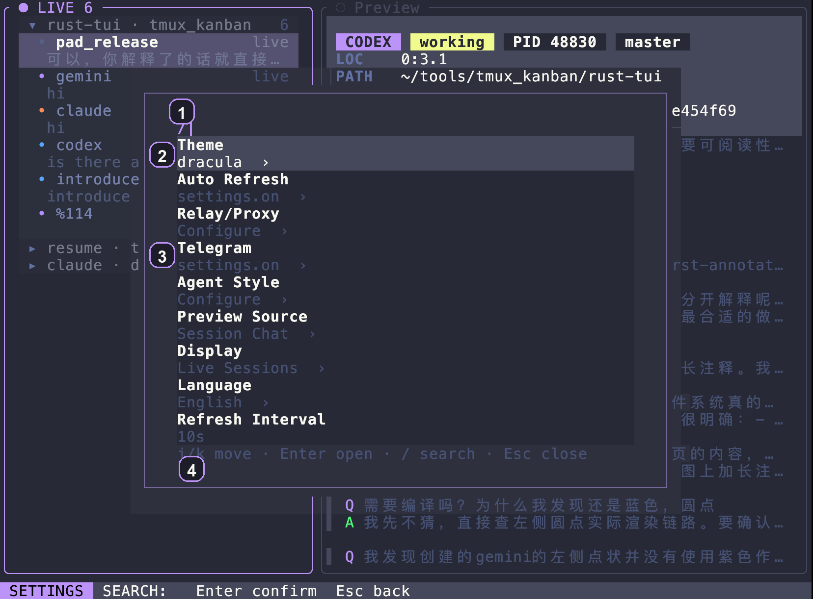
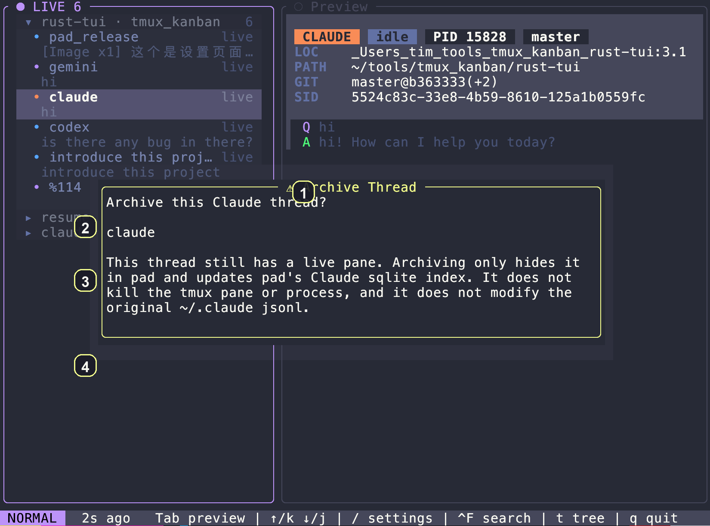
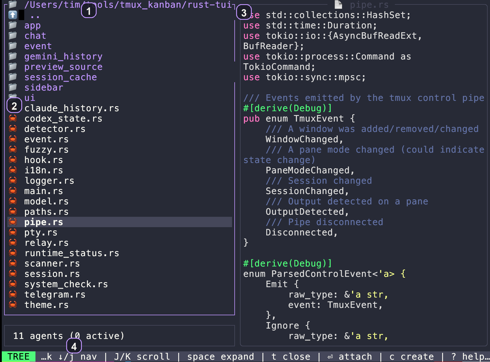
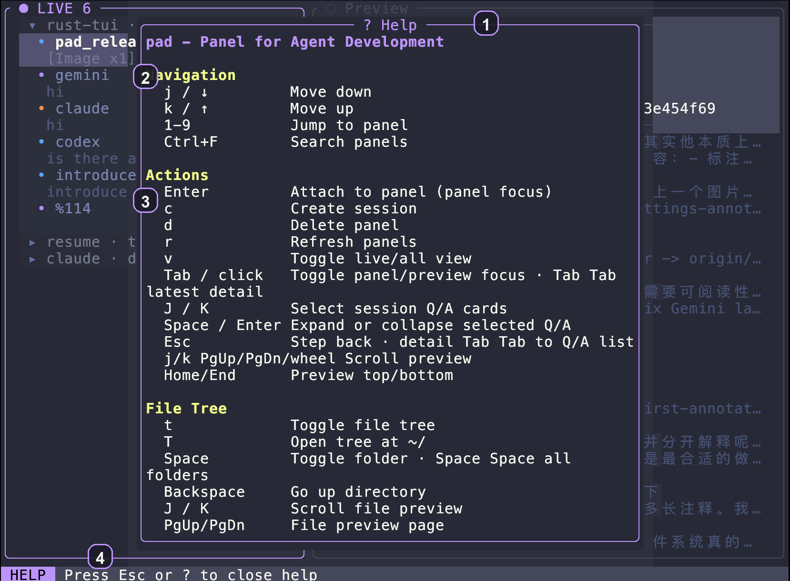

<div align="center">
  <h1>PAD</h1>
  <p><strong>Stop hunting panes. Run your AI workflow from one place.</strong></p>
  <p><code>pad</code> is the CLI for PAD: Panel for Agent Development.</p>
  <p>PAD is a tmux-native control panel focused on Codex, Claude Code, and Gemini CLI, with basic launcher and pane support for other terminal AI agents.</p>
  <p>Built for the moment when two agent panes turn into six, half of them are mid-run, and you can no longer tell what deserves your attention first.</p>
  <p>See what moved. Read the answer before you attach. Jump into the right pane and get back out fast.</p>
  <p>English | <a href="README_ZH.md">中文</a></p>
</div>

If you already keep more than one agent session open in tmux, PAD starts paying for itself almost immediately.

## Demo

<video src="https://github.com/user-attachments/assets/f4e7f833-a1a1-49ce-9d7c-9fdb9686ef49" controls muted loop playsinline width="960"></video>

What this looks like in practice:

- Open PAD and create a fresh session with `c`
- Send work, return to the dashboard with `F12`, and keep the session running
- Read the breathing activity indicator to see that the agent is still working in the background
- Double-tap `Tab` to jump from the session list into the latest preview detail
- Use `Shift+J` / `Shift+K` to move across Q&A turns inside preview detail before you attach again

If your Markdown viewer does not render inline video, open the [demo video](https://github.com/user-attachments/assets/f4e7f833-a1a1-49ce-9d7c-9fdb9686ef49) directly.

## Why PAD

The usual tmux workflow breaks down in a very boring way:

- Which pane moved last?
- Which session is still working?
- Do I need to attach, or is the answer already in preview?
- If I archive this thread, am I hiding it or actually deleting something?

PAD gives you one place to scan, preview, attach, archive, and jump back out without losing your place.

## 30-Second Workflow

1. Run `pad`.
2. Scan the left sidebar for the session that moved.
3. Read the latest turns in preview before you attach.
4. Hit `Enter` to jump in, then `F12` or `Ctrl+Q` to come back.

## Core Features

- One sidebar for live panes and recent session history
- Read the latest turns before you attach
- Jump into a pane with `Enter`, return with `F12` or `Ctrl+Q`
- Archive threads without touching upstream session data
- Relay / proxy settings for supported agents
- Completion notifications on supported desktop backends
- Keyboard-first search, settings, tree, and session creation

## What PAD Does Not Do

- It does not replace tmux.
- It does not fake tabs on top of tmux panes.
- It does not delete upstream agent history when you archive a thread in PAD.
- It does not take over the agent runtime. It helps you see and jump faster.

## Screen Tour

### Overview



Open PAD here first. This is the fast scan view.

1. `LIVE 6`: the top-level live inbox and current online session count.
2. Highlighted session row: the current target in the sidebar, ready for preview or attach.
3. Preview header: agent, state, PID, branch, path, and SID at a glance.
4. Preview turns: read the latest Q/A before you decide to attach.

### Settings



Settings stays in flow. Open it with `/`, change what you need, leave with `Esc`.

1. `/` prompt: settings comes from the same slash-driven flow as other terminal-first tools.
2. Settings list: move through config areas without leaving the keyboard.
3. Inline current values: scan current state directly from the list.
4. Footer hints: the active keys are always visible at the bottom.

### Archive



Archive in PAD is narrow on purpose. It matches the Codex-side mental model: hide it from PAD, keep the original session data intact.

1. Confirmation dialog: archive is explicit and reversible. It is not delete.
2. Target thread: the dialog shows exactly which thread is being archived before you confirm.
3. Live pane warning: if the thread still has a live pane, PAD tells you clearly that archive only hides it in PAD and updates PAD's local index.
4. Codex-aligned semantics: PAD keeps upstream session data untouched and only updates its own tracking layer. For Claude that means PAD updates its Claude sqlite index and does not modify the original `~/.claude` session source.

### Tree



Use tree mode when you want to browse code, preview a file, or create a session from a directory without leaving PAD.

1. Root path: the current workspace is always visible at the top.
2. File tree: expand, collapse, and move through directories quickly.
3. File preview: inspect code immediately on the right.
4. Tree footer: tree-mode keys stay visible, including nav, expand, attach, create, and help.

### Help



Help keeps the keyboard model discoverable inside the UI, so you do not have to context-switch to docs.

1. Help header: you are looking at PAD's built-in keyboard guide, not an external doc.
2. Navigation section: movement, jump, and search keys are grouped together.
3. Actions section: attach, create, delete, refresh, focus switching, and preview controls live in one place.
4. Close hint: the footer shows the shortest way back out.

## Also Included

- Git context in the preview header: branch, commit, and changed files
- Busy / waiting state indicators for live agent panes
- File tree browsing with file preview
- Theme switching
- Agent launcher from the tree view

## Install

Requires: `tmux` at runtime.

Supported runtime environments:

- macOS
- Linux
- WSL2

```bash
# One-line installer
curl -fsSL https://raw.githubusercontent.com/T1mn/pad/master/install.sh | bash

# Or from a local clone
git clone https://github.com/T1mn/pad.git
cd pad
./install.sh
```

The installer tries a pre-built release first, falls back to a source build if needed, and will offer to install `tmux` automatically when it is missing.

Manual source build:

```bash
cd pad/rust-tui
cargo build --profile dist
cp target/dist/pad ~/.local/bin/
```

PAD is tmux-first. Install and run `tmux` in the same environment as `pad`. On WSL2, install and run both inside WSL.

## Usage

```bash
pad              # Launch TUI
pad --help       # Show help
pad --version    # Show version
```

Release and platform notes:

- [Platform Support](docs/platform-support.md)
- [Release Checklist](docs/release-checklist.md)

## Key Bindings

| Key | Action |
|-----|--------|
| `j/k` or `↑/↓` | Navigate panels |
| `J/K` or `Shift+J/K` | Move between preview turns / jump faster in preview |
| `1-9` | Jump to panel |
| `Enter` | Attach to panel |
| `F12` / `Ctrl+Q` | Detach back to pad |
| `Tab` | Toggle panel focus and preview focus |
| `Tab` twice | Open the latest preview detail, or return detail back to the turns list |
| `?` | Help |
| `t` | Toggle file tree |
| `T` | Open tree at ~/ |
| `Space` | Expand/collapse directory |
| `Space` twice | Expand/collapse all session folders |
| `c` | Create new session |
| `d` | Delete panel |
| `r` | Refresh |
| `Ctrl+F` | Search panels |
| `/` | Open settings |
| `F1` | Settings |
| `q` | Quit |

## Agent Support

Fully supported session workflows:

- 🟣 Claude (`claude`)
- 🔵 Codex (`codex`)
- 🔷 Gemini (`gemini-cli`)

Basic launcher / pane workflows:

- 🟢 Kimi (`kimi-cli`)
- 🟠 OpenCode (`opencode`)

PAD can still detect and attach to other terminal agents, but history, archive, and session-aware preview are currently centered on Codex, Claude, and Gemini.

## License

MIT
