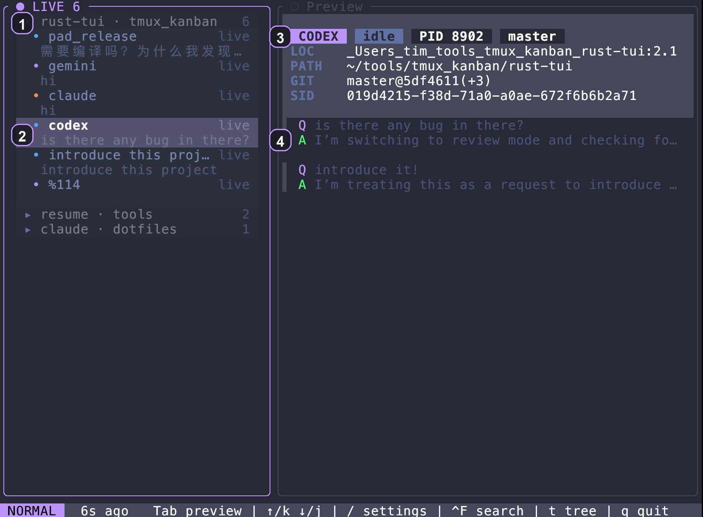
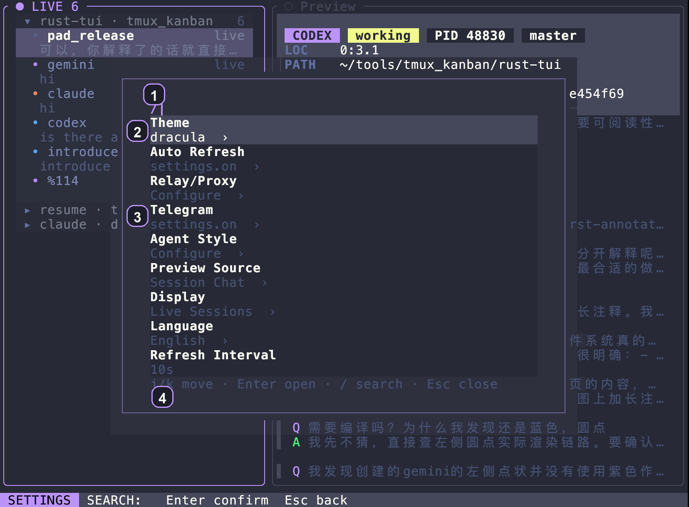
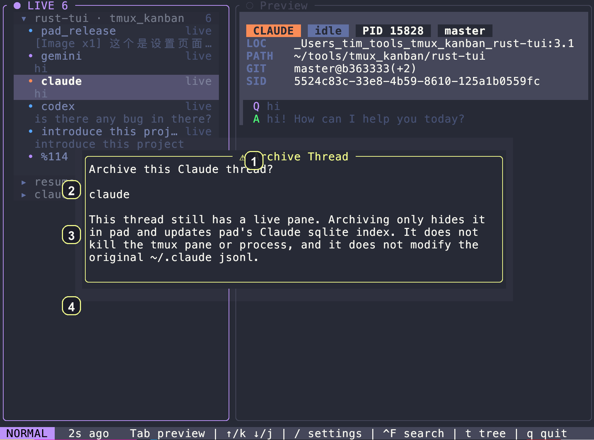
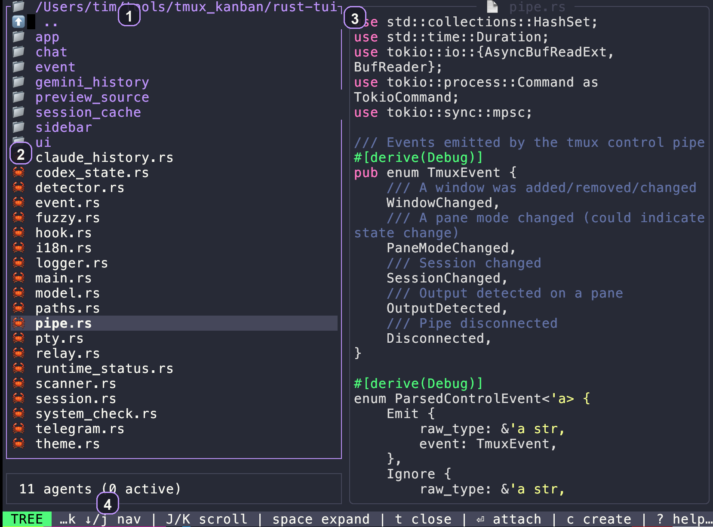
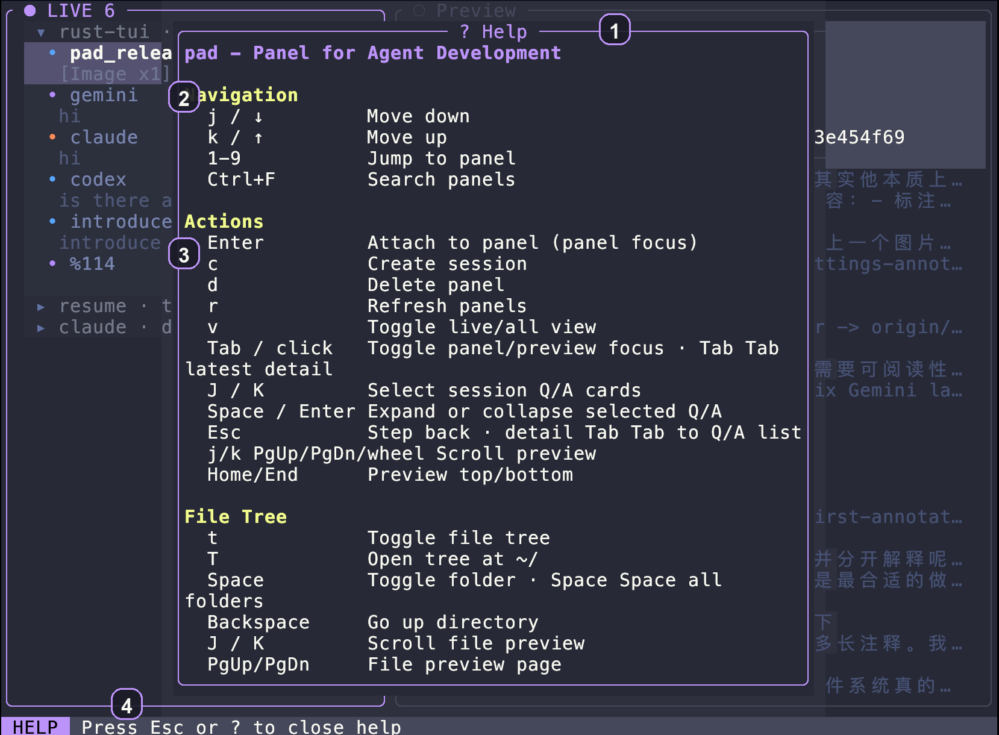

<div align="center">
  <h1>PAD</h1>
  <p><strong>别再来回找 pane 了。在一个地方跑完整个 AI 工作流。</strong></p>
  <p><code>pad</code> = Panel for Agent Development。</p>
  <p><a href="README.md">English</a> | 中文</p>
</div>

如果你平时会同时开两个以上 agent session，PAD 基本很快就能派上用场。

## 一句话总结（太长不看）

- 纯 Rust 打造，使用 PAD 自己托管的原生 PTY 终端。
- 看清谁动了，先读 preview，再进对的 pane。
- 当前 macOS 实测：dist 二进制约 3.7 MB，空闲运行时约 12 MB RSS。

## 安装

PAD 内置原生终端运行时，不需要额外安装终端复用器。

支持的运行环境：

- macOS
- Linux
- WSL2

```bash
# 一行安装
curl -fsSL https://raw.githubusercontent.com/T1mn/pad/master/install.sh | bash

# 或者从本地 clone 安装
git clone https://github.com/T1mn/pad.git
cd pad
./install.sh
```

安装脚本会优先尝试下载预编译 release，并在 Linux 上按运行时环境优先选择匹配的 glibc 或 musl 包；下载后还会验证二进制能否在当前机器上运行。只有在没有可用预编译包时，才会提示后回退到本地源码构建；进入源码构建路径时，还会按需补齐 Rust 和常见构建依赖。

安装器源码已经拆到 `install/` 目录。修改这些模块后，请重新生成仓库里提交的单文件 `install.sh`：

```bash
bash scripts/build_installer.sh
```

手动源码构建：

```bash
cd pad/rust-tui
cargo build --profile dist
cp target/dist/pad ~/.local/bin/
```

### macOS Desktop 与 iPhone Remote

仓库同时包含 [PAD Desktop](apps/pad-desktop/README.md) 和原生
[PAD Remote for iOS](apps/pad-ios/README.md)。Desktop 使用 Codex 风格的平铺侧边栏与
Pi 执行内核；在“设置 → 远程连接”开启后，iPhone 扫描 120 秒一次性二维码即可通过
WSS 直连这台 Mac，继续查看任务、对话和受控交互。

Remote v1 优先同一局域网的低延迟直连，使用叶证书 SHA-256 指纹固定、Keychain 设备令牌、
命令 UUID 回执、revision/ACK 重放和前台快速恢复。iOS 后台会保存状态并断开普通 WebSocket，
回到前台后增量续接；它不会用音频或定位权限伪装永久后台保活。账号登录、终端、目录选择、
Full Access 与 PAD/Pi 私有数据始终留在 Mac 上。

`pad` 直接托管 Shell PTY 与终端网格。如果你在 WSL2 下使用，请在同一个 WSL 环境里运行 PAD 与 agent CLI。

### 原生终端工作区

- `Tab` 聚焦右侧终端，`F12` 返回左侧。
- `C` 仍然打开 PAD 的全局目录索引，不再承担终端聚焦。
- 在全局索引里选择目录和 Agent 后，会在该目录新建 native terminal tab，并运行配置中的 Agent 命令。
- `Command+B` 折叠或恢复左侧列表；也可以直接拖动左右分隔线调整宽度。`Command+Shift+H/L` 每次缩窄/加宽 6 列。Kitty 下使用 PAD 条件映射：`map --when-focus-on var:pad cmd+b send_key f13`、`map --when-focus-on var:pad cmd+shift+h send_key f14`、`map --when-focus-on var:pad cmd+shift+l send_key f15`。
- 修改 `kitty.conf` 后，先按 `Ctrl+Command+,` 重新加载 Kitty 配置，再重启 PAD，让 PAD 重新发布 `pad` 焦点标记。
- 顶部 terminal tab 支持鼠标：点击或按住横向拖过标签来切换，点击 `×`（或中键点击）关闭整个 tab；在右侧工作区双指横向滑动也可以切换 tab。
- `F11` 打开 PAD Terminal 命令层（支持增强键盘协议时也可用 `Ctrl+Shift+Space`）。
- 命令层中：`1`～`6` 新建 Shell / Codex / Claude / GitHub CLI / OpenCode / Pi RPC 标签；`v`/`s` 创建 Shell 左右/上下分屏，`c`/`a`/`g`/`o`/`p` 创建对应 Agent 分屏。`h/j/k/l` 切换 pane，`[`/`]` 切换标签，`r` 重命名，`x` 关闭。GitHub profile 会打开带标签的交互式 Shell（在里面运行 `gh`），避免裸 `gh` 打印帮助后立即退出。
- `Shift+PgUp/PgDn/Home/End` 控制历史视口；鼠标滚轮会在应用鼠标上报与 PAD scrollback 之间自动仲裁。
- `Command+W` 关闭当前 pane；`Command+Q` 只退出 PAD，不退出 Kitty。左侧聚焦时也可以用 `q` 退出。Kitty 需要增加 `map --when-focus-on var:pad cmd+q send_key f16`。
- Native pane 会向 OpenCode 宣布 `xterm-256color` 和 truecolor，并清除父 shell 的 `NO_COLOR=1`，保证多色 TUI 正常显示。
- tab、split、label、profile 与启动目录保存到 `~/.pad/terminal-workspace.json`；重启会创建新的 PTY，并在左侧重建已知的 Codex/Claude/OpenCode live session，但不会伪装成恢复旧进程。损坏或来自更新 schema 的文件会先原样保留为 `terminal-workspace.invalid*.json`，再创建干净工作区。
- 全局 Agent Launcher 选中的命令只在本次运行中启动；PAD 重启后相应标签会安全恢复为交互式 Shell，不会静默重新执行配置文本。

## 演示

<video src="https://github.com/user-attachments/assets/773baf57-c25f-41d4-a30a-3c38e702d2d8" controls muted loop playsinline width="960"></video>

实际用起来大概就是这样：

- 在左侧树里扫一眼 live sessions，不用再到处切终端窗口找 pane
- 在右侧先读最新 preview，再决定要不要 attach
- 按 `Tab` 进入最新 detail，再用 `Shift+J` / `Shift+K` 在 Q/A 间切换
- 按 `F2` 改 thread 标题，按 `T` 编辑标签，不用离开 PAD
- 用 `c` 新建一个 session，发出任务后按 `F12` 回到 PAD
- 通过活动指示看出哪个 session 还在后台工作

如果你的 Markdown 查看器不支持内联视频，可以直接打开这个[演示视频](https://github.com/user-attachments/assets/773baf57-c25f-41d4-a30a-3c38e702d2d8)。

## 为什么要有 PAD

同时跑多个 agent 之后，最烦的往往不是“不会用”，而是这些很碎的事：

- 哪个 pane 刚刚动过？
- 哪个 session 现在还在工作？
- 我到底要不要 attach，还是 preview 里已经有答案了？
- 我 archive 这个 thread，到底只是隐藏，还是会真的删掉数据？

PAD 把这些动作收进一个地方：扫描、预览、attach、archive，然后再快速退回来继续看全局。

## 30 秒上手路径

1. 运行 `pad`
2. 在左侧 sidebar 找到刚刚有变化的 session
3. 需要浏览项目时按 `t`，打开内建文件树与文件预览
4. 先在 preview 里看最近几轮对话，再决定要不要 attach
5. 用 `Enter` 进入，用 `F12` 回来

## 核心能力

- 左侧一栏同时看 live pane 和最近的 session history
- attach 之前先把最近几轮对话读一眼
- 纯 Rust TUI，体积小，session-aware preview 响应快
- 当前 macOS 实测：dist 二进制约 3.7 MB，空闲 RSS 约 12 MB
- session 级监听，活动追踪更聚焦，也更省资源
- 用 `Tab` 进入右侧终端、`F12` 返回；在 live entry 上按 `Enter` 会跳到对应的 PAD pane
- 不离开工作区即可使用内建文件树和文件预览
- archive / restore 按 agent 使用不同适配，但不会删除上游原始历史
- 支持的 agent relay / proxy 配置
- 在支持的平台上，在 agent 完成任务后发送桌面通知
- Telegram Bot 守护进程，可用于远程查看更新和快速进入 session
- 全键盘操作的 search、settings、tree 和 session 创建

## PAD 不做什么

- PAD 重启后不会保留原有子进程，也不提供多客户端共享同一终端
- 原生 tabs/splits 是 PAD 自己托管的真实 PTY
- 它不会在 archive 时删除上游 agent 的原始历史；部分适配会更新上游 archive 元数据
- 它不接管 agent runtime，本质上是让你更快地看清、跳转、返回

## 界面导览

### 首页 Overview



这里是你进入 PAD 后最先看的地方，也是最快的扫描视图。

1. `LIVE 6`：顶部 live inbox 和当前在线 session 数量
2. 高亮 session 行：左侧当前选中的 session，可直接 preview 或 attach
3. Preview 头部：一眼看到 agent、状态、PID、分支、路径、SID
4. Preview turns：先读最近几轮 Q/A，再决定要不要进入 pane

### 设置 Settings



Settings 是保持在主流程里的。用 `/` 打开，改完后 `Esc` 退出。

1. `/` 入口：设置页沿用了终端工具常见的 slash flow
2. 设置项列表：可以全键盘移动和打开不同配置项
3. 行内当前值：不用逐个点进去，也能直接扫当前配置状态
4. 底部提示：当前可用操作键始终显示在底部，包含可用时的 Codex CLI 检查与升级操作

### 归档 Archive



PAD 的 archive 是可恢复操作，不等于 delete；具体修改的元数据取决于 agent。

1. 确认弹窗：archive 是显式且可恢复的，不是 delete
2. 目标 thread：你能明确看到这次归档的是哪一个 thread
3. Live pane 提示：如果这个 thread 仍然绑定 live pane，PAD 会在修改归档状态前明确展示目标和影响
4. 按 agent 适配：Codex 会在 active/archive 目录间移动 rollout 并更新状态库；OpenCode 更新 `time_archived`；Claude 使用 PAD 本地索引。这些路径都不会删除原始对话

### 文件树 Tree



Tree 模式适合在不离开 PAD 的情况下浏览代码、预览文件，或者直接从一个目录创建 session。

1. 根路径：顶部始终显示当前 workspace 路径
2. 文件树：快速展开、折叠并移动目录与文件
3. 文件预览：右侧即时显示当前文件内容
4. Tree 底栏：tree 模式下的按键提示会固定显示，包括导航、展开、attach、create 和 help

### 帮助 Help



Help 把键盘模型直接放在 UI 里，不需要你切出去翻文档。

1. Help 头部：明确告诉你这里是 PAD 内建的键位说明
2. Navigation 区：移动、跳转、搜索等全局导航键集中在一起
3. Actions 区：attach、create、delete、refresh、focus 切换、preview 控制等核心操作集中展示
4. 退出提示：底栏始终显示如何最快返回主界面

## 其他能力

- Preview 头部直接看 Git 信息：分支、提交、变更数
- Live agent pane 的 busy / waiting 状态提示
- 文件树浏览和文件预览
- 主题切换
- 从目录树直接启动 agent session
- 按 session 保存的 thread 自定义标题与标签

## 线程标题与标签

- 按 `F2` 可编辑当前 thread 标题
- 按 `T` 可编辑当前 thread 标签
- 编辑标题时，按 `Shift+Delete` 可快速清空整个输入框
- 自定义标题按 session 保存在 PAD 中；清空后会回退到生成标题或上游标题
- 这些修改只影响 PAD 的本地元数据层，不会改动上游原始 session 历史

## 使用

```bash
pad              # 启动 TUI
pad --help       # 查看帮助
pad --version    # 查看版本
pad telegram-bot # 启动 Telegram Bot 守护进程
```

发布与平台说明：

- [平台支持说明](docs/platform-support.md)
- [发布检查清单](docs/release-checklist.md)

Linux 发布产物现在按运行时家族分开：

- `pad-*-linux-x86_64-glibc-2.35.tar.gz`
- `pad-*-linux-aarch64-glibc-2.35.tar.gz`
- `pad-*-linux-x86_64-musl.tar.gz`
- `pad-*-linux-aarch64-musl.tar.gz`

## 快捷键

| 按键 | 作用 |
|-----|------|
| `j/k` 或 `↑/↓` | 面板导航 |
| `J/K` 或 `Shift+J/K` | 在 preview turns 中快速移动 |
| `1-9` | 快速跳转到面板 |
| `Enter` | attach 到 pane |
| `F12` | 返回 PAD |
| `Tab` | 切换 panel / preview 焦点 |
| `Tab` 双击 | 进入最新 preview detail，或从 detail 返回 turns list |
| `?` | 打开帮助 |
| `t` | 切换文件树 |
| `Ctrl+T` | 从 `~/` 打开文件树 |
| `F2` | 编辑 thread 标题 |
| `T` | 编辑 thread 标签 |
| `Shift+Delete` | 编辑标题时清空输入 |
| `Space` | 展开 / 折叠目录 |
| `Space` 双击 | 展开 / 折叠全部 session 文件夹 |
| `c` | 创建新 session |
| `d` | 删除 pane |
| `A` / `U` | 归档 / 恢复选中 session |
| `Z` | 切换归档 session 视图 |
| `E` / `S` / `I` / `H` / `M` / `G` / `X` / `B` / `O` / `P` / `Y` / `W` | 导出/导入 OpenCode JSON、安装 GitHub agent/plugin、打开 PR、运行剪贴板 prompt、启动本地 server、stats、诊断、attach server URL，或打开 OpenCode Web |
| `r` | 刷新 |
| `Ctrl+F` | 搜索 panel |
| `/` | 打开设置 |
| `F1` | 设置 |
| `q` | 退出 |

## Agent 支持情况

完整 session 工作流支持：

- 🟣 Claude (`claude`)
- 🔵 Codex (`codex`)
- 🔷 Gemini (`gemini-cli`)

增强 session / history 支持：

- 🔴 Grok Build (`grok`)：进程识别、launcher、pane attach、`--resume`、官方 session history 与 preview；暂不支持 hooks、relay、archive 和 export/import
- 🟠 OpenCode (`opencode`)：launcher 与 pane attach、relay/model 配置、SQLite history、session preview、usage/share 元数据、archive/unarchive、`opencode export` / `--sanitize` 导出、`opencode import` 导入、`opencode github install`、`opencode plugin`、`opencode pr`、`opencode run`、本地 `opencode serve`、项目 `opencode stats`、debug/provider/model 诊断、`opencode attach`、`opencode web`，以及通过 `opencode --session` 恢复会话

基础 launcher / pane 工作流支持：

- 🟢 Kimi (`kimi-cli`)

PAD 仍然可以识别并 attach 到其他终端 agent。hook 驱动的实时事件深度仍然是 Claude、Codex 和 Gemini 更完整。详见[兼容矩阵](docs/agent-compatibility.md)、[Grok 说明](docs/grok-support.md)和 [OpenCode 说明](docs/opencode-support.md)。

## 致谢

感谢更广泛的终端工具社区在早期提供的反馈与测试，也感谢我一路上在 [linux.do](https://linux.do) 学到的很多对这个项目有帮助的东西。

## License

MIT
