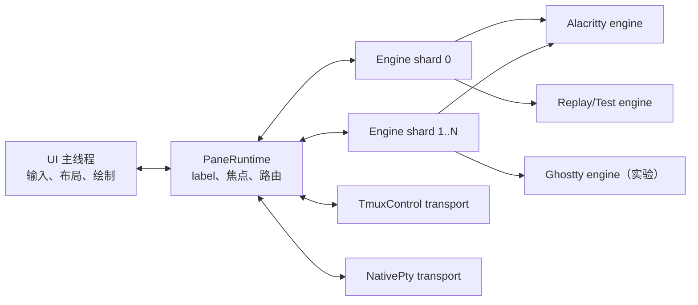

# PAD 内嵌终端实施计划

状态：已批准进入实施
计划窗口：2026-08-03 ～ 2026-09-30
首个可用版本（MVP）：2026-08-26
Beta：2026-09-16
目标正式版本：2026-09-30

## 1. 目标与边界

目标形态保持 PAD 左侧导航不变，右侧从“只读预览”逐步升级为可交互的终端 pane；每个 pane 具有 PAD 自己绘制的 label、状态、焦点与布局。

PAD 不从零实现 VT 解析器。默认运行路径由 PAD 直接创建和托管 PTY，不探测、不启动、也不配置 tmux；tmux 仅作为显式 `--tmux` 兼容模式保留。整体拆成两个可独立替换的轴：

- **TerminalEngine**：把字节流解析成可绘制的终端网格。首选 Alacritty，Ghostty 作为实验引擎，另有确定性的 Replay/Test 引擎。
- **SessionTransport**：负责进程、字节流、输入、resize 与生命周期。NativePty 是默认生产后端，tmux control mode 是可选兼容后端。

组合关系是 `PaneRuntime = PaneMetadata + TerminalEngine + SessionTransport`。label 属于 PaneMetadata，由 Ratatui 绘制，不侵入终端引擎。

## 2. 目标架构

### 线程模型

| 执行单元 | 数量 | 职责 | 明确禁止 |
| --- | ---: | --- | --- |
| UI 主线程 | 1 | crossterm 事件、Ratatui 布局/绘制、pane 焦点 | 阻塞读 PTY、直接运行 VT parser |
| Tokio I/O tasks | 每 transport 1～2 个 | tmux/native PTY 读写、生命周期、resize | 修改终端网格 |
| Engine worker shards | 默认 `min(4, CPU)` | 串行处理同一 pane 的输出，生成 snapshot | 调用 UI backend |
| 后台业务 tasks | 复用现有 runtime | 扫描、hook、历史、通知 | 持有 pane 渲染锁 |

pane 通过稳定 hash 固定到一个 engine shard。同一 pane 的 output/resize 严格有序，不同 pane 可并行。engine 在所属 worker 内创建和销毁，因此未来可容纳 `!Send`/`!Sync` 的 Ghostty binding。

通道必须有界：PTY 输出先合并成批次，再送 parser；UI 只接收 dirty 通知并拉取最新 snapshot。积压时合并更新，不丢字节，不为每个字节触发重绘。

## 3. 子引擎与传输后端

### TerminalEngine

| 引擎 | 定位 | 上线条件 | 默认状态 |
| --- | --- | --- | --- |
| Alacritty | 生产主引擎，成熟纯 Rust VT/grid | Codex/Claude/TUI 回归通过 | 默认 |
| Ghostty | 新协议能力与兼容性对照 | API、Rust/Zig 工具链和性能门槛通过 | feature flag / 实验 |
| Replay/Test | 无 PTY 的确定性测试、故障复现 | golden snapshot 稳定 | 测试与诊断 |

统一接口至少覆盖：`feed(bytes)`、`resize(size)`、`snapshot()`、`mode()`、`cursor()`、`title()`。引擎不得直接知道 tmux、Codex 或 Claude。

### SessionTransport

| 后端 | 用途 | 首发顺序 |
| --- | --- | ---: |
| NativePty | PAD 直接启动/托管子进程；默认路径完全不依赖 tmux | 1 |
| TmuxControl | 显式 `--tmux` 时保留旧会话恢复、远程/多客户端和成熟 pane 管理 | 2（兼容） |
| Replay | 从录制字节流重放 bug 与性能基准 | 1（测试） |

首个 MVP 以 NativePty 为准：画面、label、pane 焦点、键鼠路由、resize 与子进程生命周期均由 PAD 控制。tmux 不再是默认路径的前置条件。

## 4. 日程、工时与验收门

工时按 1 名主开发者估算，测试与文档包含在内；各阶段设置可回退的 feature flag，主界面在通过验收门前不切换默认路径。

| 阶段 | 日期 | 预计 | 交付物 | 验收门 |
| --- | --- | ---: | --- | --- |
| M0 设计与基线 | 08-03 ～ 08-05 | 3 人日 | 本文、终端录制样本、CPU/内存/延迟基线 | 原生与兼容路径边界明确 |
| M1 引擎接口 | 08-06 ～ 08-12 | 5 人日 | TerminalEngine、Alacritty、Replay/Test、snapshot 测试 | ANSI/Unicode/resize/alternate-screen 样本通过 |
| M2 多线程 runtime | 08-13 ～ 08-19 | 5 人日 | worker shards、有界队列、pane 顺序与关闭协议 | 8 panes 并发压测无死锁、无乱序、无丢字节 |
| M3 原生单 pane 嵌入 | 08-20 ～ 08-26 | 5 人日 | 右侧 NativePty live terminal、label 与焦点 | 无 tmux 环境可输入、resize、退出；MVP |
| M4 多 pane UI | 08-27 ～ 09-02 | 5 人日 | split/tab、pane label、焦点切换、布局持久化 | 4 panes 连续工作 2 小时无错位 |
| M5 交互兼容 | 09-03 ～ 09-09 | 5 人日 | bracketed paste、mouse、scrollback、IME/Unicode、快捷键仲裁 | Codex/Claude/GitHub CLI 核心流程通过 |
| M6 兼容迁移 | 09-10 ～ 09-16 | 5 人日 | tmux 显式兼容模式、旧会话迁移提示、配置升级 | 默认路径无 tmux，兼容模式可回退；Beta |
| M7 Ghostty spike | 09-17 ～ 09-23 | 4 人日 | adapter、兼容性与工具链报告 | 达标则保留实验开关，否则冻结，不阻塞发布 |
| M8 稳定与发布 | 09-24 ～ 09-30 | 5 人日 | 性能、崩溃恢复、文档、迁移与回滚开关 | 发布清单、全量 CI、24 小时 soak 通过 |

总计约 42 人日。若只有单人串行投入，以上是合理上界；可并行的工作流是“引擎/录制测试”“transport”“UI/交互”，但合并必须依次通过 M1、M2、M3 三个架构门。

## 5. 性能与正确性指标

- 输出到可见帧的 p95 延迟：本机交互负载小于 50 ms。
- UI 主线程单帧工作：常态小于 8 ms，不因任一 pane 高输出阻塞。
- 8 个活跃 panes 时不丢输入/输出字节；同一 pane 事件顺序完全一致。
- resize 后下一次 snapshot 尺寸正确，不出现跨 pane 内容污染。
- 终端 parser panic 或 transport 退出只关闭对应 pane，PAD 主进程仍可操作。
- release/dist profile 保持 `panic = "unwind"`；若未来恢复 abort，必须先把 engine 移到独立进程。
- 默认路径不得调用 tmux；显式 `--tmux` 可回退到旧 attach 模式。

## 6. 主要风险与决策点

- **Ghostty API/工具链变化**：只作为 M7 实验适配器；不让其决定核心接口，也不作为 9 月发布阻塞项。
- **tmux control mode 输出语义**：M3 前用录制流验证 `%output`、转义、alternate screen；不满足时可先以 native PTY 达成单 pane。
- **快捷键冲突**：PAD 全局键只保留一个明确的 command layer，其余按键原样下发到 pane。
- **内存与复制**：M1 先保证正确；M2 引入批处理、dirty snapshot 与共享缓冲，基准不达标再优化 cell 表示。
- **范围膨胀**：首版不实现 shell integration、GPU 渲染、终端插件市场，也不 fork Alacritty/Ghostty 核心。

## 7. 当前执行顺序

1. 建立 engine/transport/runtime 接口和多线程测试。
2. 接入 Alacritty，并用 ReplayTransport 做可重复的 parser 测试。
3. 以 NativePty 完成右侧单 pane MVP，默认启动不触碰 tmux。
4. 单 pane 稳定后打开 tab/split、pane label/profile 和布局持久化。
5. 最后补齐显式 tmux transport 兼容层，不让它反向污染 native 核心。

任何阶段若验收门失败，保持 `--tmux` 兼容入口可用；默认 native 路径不得静默回退或偷偷启动 tmux。

## 8. 分支与并行工作流

实现统一在 `codex/embedded-terminal-runtime` 分支进行，默认分支不直接承接未通过验收门的代码。并行工作按文件所有权拆分，合并时由主线执行跨模块审查：

| 工作流 | 范围 | 主要产物 |
| --- | --- | --- |
| Engine workers | engine registry、分片、有界队列、错误与关闭协议 | 顺序/并行/背压/故障测试 |
| Transport/Replay | transport command/event、确定性字节流重放 | tmux/native 共用协议与 replay 测试 |
| Alacritty compatibility | cell、颜色、Unicode、cursor、mode、scrollback | VT/TUI 协议回归样本 |
| Integration | PaneRuntime、UI/tmux 接入、文档与全量回归 | feature gate、端到端测试与发布判断 |

## 9. 测试矩阵

每次阶段合并至少执行：

1. `cargo fmt -- --check`。
2. `cargo clippy --all-targets --all-features -- -D warnings`。
3. `cargo test terminal_runtime`，覆盖 parser、pane、transport 和 worker。
4. `cargo test`，验证 PAD 现有 tmux、preview、session 与 UI 行为无回归。
5. M2 增加 8 panes 并发、高输出、反复 resize/close、worker 故障测试。
6. M3 起增加真实 Codex、Claude、GitHub CLI 的录制回放和交互 smoke test。
7. 发布前运行 24 小时 soak；记录 CPU、RSS、输出到帧的 p50/p95/p99。

协议测试必须至少覆盖普通/256 色/RGB、粗体与下划线、宽字符与组合字符、cursor shape、alternate screen、bracketed paste、mouse mode、scrollback、窗口 resize、进程正常/信号退出，以及通道饱和时不丢字节。

## 10. 分支进度（2026-08-03）

`codex/embedded-terminal-runtime` 已完成 M1/M2，并提前打通 M3 的 native-first 主链路：TerminalEngine/SessionTransport 接口、Alacritty adapter、ReplayTransport、分片 engine workers、有界 transport runtime、LivePaneRuntime、后台 TerminalController、NativePty 进程托管、右侧实时渲染、label、焦点、键鼠、bracketed paste、resize、退出码与 panic 隔离。默认启动跳过 tmux 探测和配置，只有显式 `--tmux` 才进入兼容路径。

当前验收：终端运行时 94 项测试通过；PAD 全量 881 项中 877 项通过、4 项既有 ignored；单槽高输出 + 强制退出竞态连续运行 50 次通过；严格 Clippy、dist profile 和真实无 tmux 交互 smoke 均通过。

M3 当前提供原生单 pane 基础，不代表高可玩性的多 pane 产品已经完成。下一门禁是：tab/split 与 pane profile/label 编辑、布局持久化、scrollback 交互，以及真实 Codex、Claude 与 GitHub CLI smoke。像素尺寸查询在宿主提供真实 cell/window 像素度量前保持显式 unsupported。
