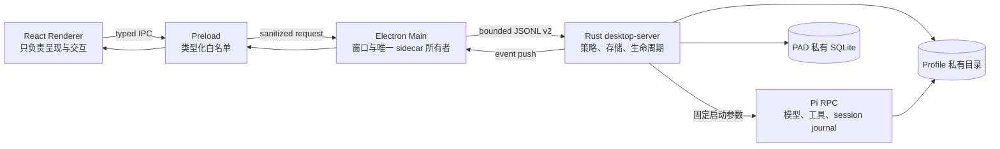

# PAD Desktop macOS 实施计划

状态：M0–M7 本机交付完成；External 分发门禁待 Developer ID 与独立干净 Mac
分支：`feat/pad-desktop-pi-integration`
目标平台：Apple Silicon、macOS 13 及以上
视觉基线：本机 Codex `26.825.41651` / build `7345`

## 1. 目标

交付一个可直接双击安装和使用的 `PAD Desktop.app`：界面层级、密度、侧边栏、
任务时间线、Composer、设置和窗口行为对齐 macOS Codex；执行内核、账号、权限、
会话和持久化全部由 PAD + Pi 自己实现。

“对齐”指可观察的 macOS 交互和视觉层级对齐，不复制 Codex 的私有源码、资源、
品牌、登录服务或内部协议。

完成定义同时包含：

- 平铺式 Codex 层级，而不是网页卡片或悬浮侧栏。
- Pi 作为唯一 Agent runtime，Rust 作为唯一可信控制面。
- 多账号可视化登录、切换、退出和状态恢复。
- PAD 私有 SQLite、Profile、Pi session 与 Codex/ChatGPT 完全隔离。
- Full Access 真正减少普通任务确认，但永不绕过凭据、产品私有数据和 macOS TCC。
- 完整简体中文、键盘操作、VoiceOver 标签和窄窗口适配。
- App 自带 PAD、Bun、Pi；目标 Mac 不要求 Homebrew、Node、Bun 或 Pi。

## 2. 系统边界与数据流



禁止路径：Renderer 不读 SQLite、不读取本地文件、不接触环境变量、不启动 Pi；
Electron Main 不决定权限；Pi 不直接使用 Codex/ChatGPT 数据目录。

## 3. 状态所有权

| 状态 | 唯一所有者 | Renderer 能力 |
| --- | --- | --- |
| Profile、Project、Task、Section | Rust + PAD SQLite | 读取安全 DTO、发命令 |
| Active Profile、折叠、宽度、选中项 | Rust UI state | 读取与更新明确字段 |
| Provider 登录流程 | Rust auth coordinator | 显示步骤、提交输入、取消 |
| Provider credential | Profile 私有目录 / Keychain 适配层 | 只能看到已认证状态 |
| Pi 进程和 session writer | Rust supervisor | 启动任务、停止、订阅事件 |
| Pi session journal | Profile 私有 Pi session 目录 | 读取格式化后的历史 |
| Full Access 决策 | Rust permission policy | 开关 Profile policy |
| 临时视图状态 | React | route、hover、当前输入草稿 |

任何 DTO 都不得暴露 credential、环境变量、真实 agent/session 私有路径或 Codex/
ChatGPT 路径。

## 4. macOS 界面层级

```text
PAD Desktop Window
├── hidden-inset 原生标题栏（46）
└── AppShell
    ├── 平铺 Sidebar（默认 275，可调 240–520）
    │   ├── 新任务 / 搜索 / 需要关注
    │   ├── 置顶任务
    │   ├── 自定义 Section
    │   ├── Project
    │   │   └── Task
    │   ├── 未归档最近任务
    │   └── Account / Settings
    ├── Main Surface
    │   ├── Task Toolbar（40）
    │   ├── Turn Timeline（正文最大 768 / 48rem）
    │   └── Composer
    ├── Right Inspector（可选、独立焦点域）
    ├── Bottom Terminal（可选、独立焦点域）
    └── Overlay Root（搜索、账号、登录、确认）
```

桌面宽度下 Sidebar 永远平铺；只有 `<=720px` 才变为覆盖层。项目、任务和分区排序
必须直接消费 Rust sidebar snapshot，前端不得用 flat records 自行重建第二套层级。

### 4.1 Codex 层级逐层映射

| Codex 可观察层 | PAD 实现责任 | 唯一状态源 | 对齐验收 |
| --- | --- | --- | --- |
| 原生窗口与交通灯 | Electron `BrowserWindow` + hidden inset | Electron Main | 拖动区、全屏、最小尺寸、原生焦点行为一致 |
| 全局标题栏 | `GlobalTitlebar` | Window/UI state | 侧栏开关、拖动区、窗口按钮不重叠 |
| 平铺左侧栏 | `Sidebar` | Rust `sidebar snapshot` | 宽屏不悬浮，默认 `275px`，可拖到 `240–520px` |
| 快捷入口 | 新任务、搜索、需要关注 | Rust hierarchy + menu action | `⌘N`、`⌘K`、未读/运行状态实时一致 |
| 分组层级 | 置顶、Section、Project、Task、最近、归档 | Rust hierarchy | 排序、缩进、折叠、选中均不由前端重建 |
| 账号入口 | 侧栏底部账号菜单 | Rust Profile/Auth | 添加、切换、登录、退出后只出现目标 Profile 数据 |
| 任务顶栏 | `TaskToolbar` | 当前 Task/Project | 标题、项目、面板按钮与任务状态同步 |
| 对话正文 | `TurnTimeline` | 格式化后的 Pi/PAD event | 用户、助手、工具、错误、确认、输入、完成态顺序稳定 |
| 输入区 | `ThreadScrollFooter/Composer` | 当前 Task + policy | 自适应高度；发送/停止/重试状态机正确 |
| 右侧检查器 | `RightInspector` | 真实 tool/diff/artifact DTO | 无假 Diff、无私有路径、无生产 Mock |
| 底部终端 | `BottomTerminal` | Rust NativePty controller | 真输入输出、Unicode、resize、退出码、关闭回收 |
| 设置页 | 两栏 `SettingsView` | Rust Profile/Auth/Policy | 通用、账号、Pi、权限、数据、关于全部中文 |
| 覆盖层 | Search/Account/Auth/Confirm sheet | Rust coordinator + transient React state | 键盘焦点圈定、Esc 行为、错误恢复、无凭据泄露 |

### 4.2 层级状态恢复规则

- App 重启后恢复 active Profile、selected Task、Section/Project 折叠、侧栏宽度、主题和面板开关。
- Profile 切换先清空当前任务树，再原子加载目标 Profile 快照，禁止短暂显示上一账号内容。
- 任务、账号或 Sidecar 崩溃恢复后，Sidebar 与 Timeline 通过 revision 重新同步；Renderer 不猜测缺失状态。
- 同一 PAD 数据根只能有一个 `desktop-server` 写者；第二实例必须在打开 SQLite/Pi journal 前失败。
- 任何恢复流程都不探测或迁移 `.codex`、ChatGPT container、Codex Session 或独立 Pi 数据根。

### 4.3 可验收层级 ID

后续实现、截图和缺陷都必须引用下列稳定 ID，避免把“像 Codex”退化成无法验收的主观描述。

| ID | 层级 | DOM / 原生边界 | 状态所有者 | 必须覆盖的状态 |
| --- | --- | --- | --- | --- |
| `W1` | macOS Window | `BrowserWindow`、hidden inset、交通灯安全区 | Electron Main | active/inactive、全屏、最小尺寸、恢复 |
| `T1` | Global Titlebar | Sidebar toggle + drag region | React + Rust UI state | sidebar open/closed、键盘菜单、浅/深/系统 |
| `S1` | Sidebar commands | 新任务、搜索 | React action + Rust command | normal/hover/focus/disabled/searching |
| `S2` | Sidebar hierarchy | Section → Project → Task | Rust sidebar snapshot | empty/selected/running/attention/unread/collapsed |
| `S3` | Account footer | active Profile + account menu | Rust Profile/Auth | authenticated/missing/partial/unknown/switching |
| `M1` | Task toolbar | title、project、status、panel toggles | selected Task | idle/running/failed/completed/no-task |
| `M2` | Turn timeline | user/assistant/tool/interaction/status | Pi history + Rust poll | long/running/error/approval/input/final |
| `M3` | Composer | prompt + permission + send/stop/retry | selected Task + policy | empty/multiline/blocked/sending/stopping/retry |
| `R1` | Right inspector | activity/files/changes | real tool DTO only | empty/changed/failed/selected file |
| `B1` | Bottom panel | NativePty terminal | Rust terminal controller | opening/running/exited/failed/resized |
| `O1` | Overlay root | auth/account/project/error sheets | Rust coordinator + React transient state | open/busy/error/success/Escape/focus trap |
| `P1` | Settings page | category rail + details | Rust Profile/Auth/Policy/UI state | general/account/Pi/permission/data/about |

每一层都必须同时通过：可见层级、状态所有权、鼠标、键盘、VoiceOver 名称、空态、错误态、
忙碌态和恢复态。任何 production UI 都不得用 flat records 重建 `S2`，不得把任意 tool 文本
冒充 `R1` 文件变更，也不得把未知 Pi 请求伪装成已处理。

### 4.4 尺寸与焦点矩阵

| 视口 | Sidebar | Right panel | Bottom panel | Overlay |
| --- | --- | --- | --- | --- |
| `1440×900` | tiled，可调 | tiled | tiled | viewport-centered |
| `1280×820` | tiled，默认 275 | tiled | tiled | viewport-centered |
| `960×720` | tiled/collapsible | overlay | tiled | viewport-centered |
| `720×700` | overlay | overlay | tiled | viewport-centered |
| `480×600` | overlay | overlay | full-width | viewport-centered |

焦点顺序固定为 `T1 → S1/S2/S3 → M1/M2/M3 → R1 → B1`；只有已打开层进入顺序。
`O1` 打开后必须圈定焦点并让其他层 inert，关闭后把焦点还给触发控件。侧边栏树使用 roving
tabindex；方向键、Home/End、左右折叠展开和 Enter/Space 必须符合 macOS 树导航预期。

## 5. 账号与登录流程

每个账号对应一个 PAD Profile：

1. 用户在账号菜单选择“添加 Pi 账号”。
2. Renderer 调用 `auth_begin(profile, provider)`。
3. Rust 启动唯一受管 Pi auth 流并返回步骤：浏览器 URL、设备码、文本输入或完成。
4. Renderer 使用 macOS sheet 呈现步骤；`auth_respond` 只提交当前交互需要的数据。
5. Rust 保存结果、刷新 provider 状态并推送 `auth_changed`。
6. 切换账号后，Rust 返回该 Profile 的 sidebar、task 和 session；其他 Profile 不可见。
7. `logout` 只清理目标 Profile 的 provider credential，不删除任务和历史。

升级和恢复要求：登录中的进程在 App 退出时被取消；重启后显示明确的“已中断”，不得
伪装为仍在登录。账号切换不能复用另一 Profile 的 session file、credential ref 或 cwd。

## 6. Full Access

权限唯一决策链为 `Profile -> Project -> Task -> evaluate_operation`：

- `Guarded`：危险操作显式询问。
- `Workspace Full`：仅工作区内普通操作自动通过。
- `System Full`：普通外部操作可自动通过。
- `unattended=true` 仅允许明确的工具权限 confirm 自动回答。

永久禁止自动放行：PAD 数据、Pi agent/session、Profile credential、`.codex`、ChatGPT/
Codex container、Keychain、macOS TCC、跨 Profile 路径、业务 select/input/editor。

UI 开关必须先写入 Rust 并读回结果；失败时回滚界面，不能只改 `localStorage`。

## 7. Desktop protocol v2

协议采用有界 JSONL envelope：

- `hello`：protocol range、host/app/core/Pi versions、capabilities。
- 查询：`bootstrap`、`list_sidebar`、`history`、`runtime_snapshot`。
- 任务：`create_task`、`start_task`、`prompt`、`abort`、`retry_task`、`stop_task`。
- UI：`respond_ui`、`set_task`、`set_profile`、`get_ui_state`、`set_ui_state`。`set_ui_state`
  必须提交完整文档（active/selected/collapse/sidebar width/theme/panel visibility）；Rust 在写入前
  将不存在的 Profile 和跨 Profile Task 引用归一化为安全值，bootstrap/list_sidebar 返回同一
  SQLite 状态，Renderer 本地缓存不作为事实源。
- Auth：`auth_begin`、`auth_status`、`auth_respond`、`auth_cancel`、`logout`。
- Terminal：`terminal_open`、`terminal_input`、`terminal_resize`、`terminal_snapshot`、
  `terminal_close`。
- 事件：`task_changed`、`runtime_changed`、`interaction_changed`、`auth_changed`、
  `sidebar_changed`、`terminal_changed`。

v1 保留兼容读取和迁移期请求；新 Renderer 只消费 v2 安全 DTO。未知字段忽略、未知动作
拒绝、单帧上限 1 MiB（请求、响应和事件一致；超大响应返回 `response_too_large`）、stderr 上限 512 KiB、请求默认 30 秒超时；断连后所有 pending
promise 必须失败并显示可恢复错误。

## 8. 工作包与验收门

执行顺序按发布风险固定，不以“页面已经能打开”作为跳过后续门禁的理由：

1. `P0-A`：Rust snapshot canonical、跨 Profile 数据隔离、协议边界。
2. `P0-B`：Pi approval/select/input/editor 可见且可真实响应。
3. `P0-C`：packaged renderer、sidecar、NativePty 可启动且零孤儿进程。
4. `P1-A`：`W1/T1/S1/S2/S3` 几何、键盘、响应式和恢复。
5. `P1-B`：`M1/M2/M3/R1/B1/O1/P1` 真实数据、空错忙态和辅助功能。
6. `P1-C`：性能、签名、安装、回滚和产物哈希。
7. `External`：Developer ID、公证、staple 与外部干净 Mac Gatekeeper。

### M0：基线和分支

- 固化 Codex 可观察层级、尺寸、颜色、交互和 Golden matrix。
- 建立本分支、文件所有权、多 Agent 并行边界。
- 验收：baseline 文档、index、branch 均存在。

### M1：Rust 安全控制面

- 固定 Pi launcher，拒绝 Renderer 命令注入。
- Profile/Pi 目录 `0700`、私有文件 `0600`、拒绝 symlink 穿透。
- Full Access 使用统一策略合并和决策。
- 验收：policy/path/runtime/store 测试和 command-injection sentinel 全过。

### M2：Electron 宿主

- 单实例、hiddenInset、CSP、sandbox、context isolation。
- Main 只启动一个随包 Rust sidecar；退出时同步回收。
- Preload 仅暴露 typed allowlist。
- 验收：typecheck、生产构建、独立数据目录真实启动、无残留进程。

### M3：Codex 层级 Renderer

- 平铺 Sidebar、Task Toolbar、Timeline、Composer、Inspector、Bottom Panel、Settings。
- 真实 sidebar hierarchy、历史、任务状态和事件；删除全部生产 Mock/假 Diff/假 Terminal。
- 验收：UI unit tests、Golden matrix、窄窗口、键盘、VoiceOver。

### M4：账号和中文登录

- 可视化添加、认证步骤、取消、重试、退出、切换。
- 所有字符串进入中文资源层；错误、空状态、权限和恢复信息无英文漏出。
- 验收：两个隔离 Profile 往返切换，历史和 credential 不交叉。

### M5：Protocol v2 与恢复

- safe DTO、capability negotiation、push event、v1 migration。
- Renderer reload 和 host/Pi 异常恢复；pending interaction 不丢失。
- 验收：协议边界、超限、非法帧、断连、重启和 v1 数据升级测试。

### M6：面板与终端

- Inspector 只展示真实 tool/diff/file/summary 数据。
- Bottom Panel 接入 PAD NativePty controller；输入、resize、退出和 task cwd 正确。
- 验收：真实 shell 输入输出、Unicode、resize、关闭不影响主任务。

### M7：打包、安装和发布

- arm64 release 内含 `pad`、Bun、Pi，产品名 `PAD Desktop`，bundle id
  `cn.ghostcloud.pad.desktop`，最低 macOS 13。
- 生成 `.app`、`.zip`、`.dmg` 和 SHA-256 manifest；安装到 `/Applications` 后回读。
- 有 Developer ID 时签名、公证和 staple；无发布证书时只允许标记为本机验收包，不能声称
  已通过外部干净 Mac Gatekeeper。
- 验收：真实 App 黑盒、数据隔离、进程清理、签名、产物哈希和安装启动。

## 9. 测试矩阵

| 层 | 必测项目 |
| --- | --- |
| Rust unit | Store、路径权限、policy merge、protected namespace、auth state、terminal |
| Protocol | v1/v2、capability、unknown action/field、1 MiB、断连、事件顺序 |
| Renderer | hierarchy、account switch、login、Full Access、composer、responsive、a11y |
| Integration | task create/start/prompt/stop/retry、history、approval/input、restart |
| Isolation | Profile A/B、独立 Pi root、Codex/ChatGPT before/after 元数据与哈希 |
| Visual | light/dark × 1280/1440/960/720/480，SSIM `>=0.985`（排除原生抗锯齿） |
| Performance | 首屏、history load、event latency、idle CPU/RSS、长列表滚动 |
| Package | arm64、plist、icon、无多余 TCC/ATS、codesign、bundle runtime versions |

发布前命令门禁：

```text
cargo fmt --check
cargo clippy --all-targets --all-features -- -D warnings
cargo test --locked
npm run typecheck
npm run test:ui
npm audit --omit=dev --audit-level=high
python3 scripts/ci/check_index.py
python3 scripts/ci/pad_desktop_electron_e2e.py --app <app>
git diff --check
```

视觉报告必须区分两种结论：有经授权且版本匹配的 Codex Golden 时才计算并声明 SSIM；没有
该 baseline 时标记 `NOT_EVALUATED`，不得用 PAD 自己的截图充当 Codex Golden。即便 SSIM
未评估，本地 geometry、overflow、focus、中文截断、ARIA、浅/深主题和五尺寸截图仍必须全部
执行并单独给出 PASS/FAIL。

## 10. 性能和可用性目标

- 可交互首屏：热启动 `<=1.5s`，冷启动 `<=3s`。
- 任务事件到 UI：p95 `<=100ms`；终端输出到帧：p95 `<=50ms`。
- 5,000 个任务的侧栏筛选不阻塞主线程；滚动维持 55–60 fps。
- 空闲 CPU `<=2%`，10 个历史任务加载后 RSS 目标 `<=450 MiB`。
- 关键操作全键盘可达；focus ring 不被裁切；VoiceOver 有中文名称和状态。

## 11. 交付物

- `/Applications/PAD Desktop.app`
- `outputs/PAD-Desktop-0.7.5-arm64.dmg`
- `outputs/PAD-Desktop-0.7.5-arm64.zip`
- `outputs/SHA256SUMS.txt`
- Golden/黑盒/隔离/性能测试报告
- 本文和视觉 baseline

只有 M0–M7 全部通过后才标记完成；单次成功启动、单张截图或编译通过都不是完成。

## 12. 0.7.5 完成记录（2026-08-30）

| 里程碑 | 结果 | 完成证据 |
| --- | --- | --- |
| M0 基线和分支 | PASS | 本文、Codex alignment baseline、专用 feature branch |
| M1 Rust 安全控制面 | PASS | `fmt`、`clippy -D warnings`、98 tests passed / 2 ignored；34 组受保护路径 fail-closed |
| M2 Electron 宿主 | PASS | arm64 打包、sandbox/context isolation、protocol v2、退出零残留 |
| M3 Codex 层级 Renderer | PASS | 10 个视口/主题截图、232 项布局与辅助功能检查、127 个 UI tests |
| M4 账号和中文登录 | PASS | 双 Profile 登录/切换/历史隔离黑盒测试；关键生产文案全中文 |
| M5 Protocol v2 与恢复 | PASS | 1 MiB 边界、安全 DTO、revision/UI state、reload 与数据根单写者测试 |
| M6 面板与终端 | PASS | 真实 NativePty 子进程、Unicode/input/resize/close 与任务生命周期测试 |
| M7 打包、安装和发布 | PASS（本机） | 0.7.5 ZIP/DMG/SBOM/SHA-256；安装健康探针后写入 `/Applications` 并启动 |

最终本机性能为冷启动 `0.351s`、bootstrap check `0.004s`、空闲 CPU `1.095%`、
RSS `440.2 MiB`、renderer heap `2.6 MiB`。安装前的 0.1.0 App 已保存在交付目录的
`install-backups/`，安装源与已安装 App 的主程序、`app.asar`、PAD、Bun、Pi 均逐字节一致。

本机包采用 ad-hoc 签名，因此 External 门禁不计入 M0–M7 的本机完成结论。面向其他 Mac
公开分发时，仍必须提供 Developer ID，完成 Apple 公证、staple、Gatekeeper 和另一台干净
Mac 的实际安装。没有经授权且版本匹配的 Codex Golden，SSIM 继续标记为
`NOT_EVALUATED`；本次不声称做过 Codex 像素截图比较。
