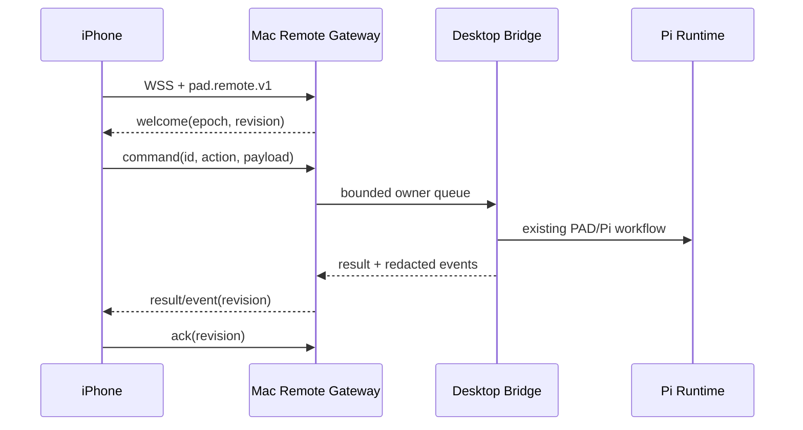

# PAD Remote for iOS

状态：P0 代码与 Mac 本机验收完成；iOS 真机验收待设备和 Xcode platform 可用
版本：`0.7.6`
平台：iOS 17+；宿主为 Apple Silicon macOS 13+

## 1. 目标与边界

PAD Remote 是 PAD Desktop 的原生 iOS 遥控端。Mac 上的同一个 Rust
`desktop-server` 仍然是 Profile、Task、Pi 进程、会话历史和权限的唯一所有者；iPhone
只接收脱敏后的任务投影并提交白名单命令。

P0 只承诺同一局域网直连。Tailscale/VPN 仍需要 endpoint 地址重写与真实网络验证，不能把
二维码中的 `.local`/LAN 地址直接视为已交付的跨网能力。它不读取、迁移或写入 Codex、
ChatGPT 与外部 Pi 数据目录，也不把 PAD 凭据或真实工作路径发送到手机。

## 2. 快速路径



- 首次连接：Mac 设置页生成 120 秒一次性二维码；iPhone 扫码后校验 TLS 证书指纹并换取设备令牌。
- 热连接：WSS 长连接、10 秒心跳、每客户端独立有界队列；有手机在线时 Mac 保持系统活跃但允许熄屏，慢客户端不会阻塞 Mac UI 或其他设备。
- 断线恢复：手机持久化 `server_epoch + revision + command_id`，重连先请求缺口回放；回放窗口之外改取快照。
- 防重复：每个写命令使用稳定 UUID，Mac 保存限时执行回执；响应丢失后重发不会再次执行。
- 前后台：iOS 进入后台时保存 ACK、outbox 和缓存后主动断开；回到前台立即恢复，不伪装普通 WebSocket 可以永久后台常驻。

## 3. 安全模型

配对二维码只在用户主动打开的 sheet 内存在，使用 `pad://remote/pair` URI，包含版本、
percent-encoded WSS endpoint、叶证书 DER 的 SHA-256 指纹、配对 id 和 256-bit 一次性
secret。配对 ticket 在 Mac 端 120 秒后过期；secret 最多尝试三次，成功、取消或过期后立即
失效。长期 token 只保存于 iOS Keychain；Mac 只持久化其哈希，远程目录
权限为 `0700`、私有文件为 `0600`。

远程白名单只覆盖任务列表、历史、创建、启动、发送提示、停止/中止、重试及受控的 UI
交互响应。P0 明确拒绝远程登录/退出账号、切换 Profile、修改 Full Access、打开终端、修改
工作目录、读取凭据或访问宿主文件路径。配对设备固定绑定一个 Profile，所有 Task 请求都
重新校验 Profile 归属。

## 4. 一致性与背压

Mac 为每次可见状态变更分配单调 `revision`，并在当前 `server_epoch` 内保留最多 8192 条或
16 MiB 的脱敏事件。每个手机连接最多排队 256 帧或 2 MiB；超过预算时发送
`resync_required` 并关闭该慢连接，而不是让全局生产者等待。

客户端只有在事件已经应用并持久化之后才 ACK。发现 revision 缺口、epoch 改变或回放过期
时，客户端丢弃推测状态并请求完整快照。一个 connection generation 只允许一条接收循环，
旧连接的迟到回调不能覆盖新连接状态。

## 5. iOS 信息架构

```text
PAD Remote
├── 配对页：扫码、手动粘贴、证书指纹校验、错误恢复
├── 任务侧栏：任务状态、搜索、选择、离线缓存
├── 时间线：用户、助手、工具、交互、运行/错误状态
├── Composer：发送、停止、离线 outbox 状态
└── 连接状态：在线、恢复中、离线、需重新配对
```

UI 使用 SwiftUI、系统动态字体、SF Symbols、系统颜色和原生 sheet/navigation；默认简体
中文，并保留 VoiceOver 名称、触控热区、Reduce Motion 与深浅色适配。

## 6. 验收门

P0 交付必须同时满足：

- Rust、Electron/React、Swift 三端协议契约一致，未知动作和未知敏感字段 fail closed。
- 同一局域网已建立连接下，命令到结果首帧 P95 小于 150 ms（不含模型推理）；前台热恢复 P95 小于 1 秒。
- 网络切换、短断网、Mac UI 刷新、响应丢失和重复命令场景中，不丢已确认事件、不重复执行动作。
- 慢客户端和恶意超大帧不会阻塞 Mac 本地操作；撤销设备后现有连接和后续重连均失败。
- 通用 iOS 设备与 Simulator 目标可编译；协议、状态机和安全边界单测通过。
- 真机最终门包含二维码相机、局域网权限、睡眠/唤醒、Wi-Fi 切换和至少 30 分钟前台 soak。

不在 P0 内：公网中继、APNs 唤醒、离线消息云存储、多 Mac 目录服务，以及用音频/定位等
后台模式维持假常驻连接。

## 7. 当前验证结果

- Rust 全量测试：98 passed、2 个基准测试按设计 ignored；`fmt`、`check`、`clippy -D warnings` 与结构门禁通过。
- PAD Desktop：141 个 UI 测试通过；arm64 应用完成打包、签名、Fuses、随包 Pi/Bun/PAD 和数据隔离黑盒验证。
- 安装包内 Remote v1 真实 WSS 黑盒：命令 P95 `0.5 ms`，热恢复 P95 `14.4 ms`；配对、重复命令、重放、重启、禁用、撤销与跨 Profile 拒绝均通过。
- iOS：Simulator App、Device App、XCTest 源码三项目标均完成 Swift 类型检查；plist、工程、资源 JSON 与无 alpha AppIcon 通过静态门禁。
- 当前 Mac 的 CoreSimulator `1051.50` 低于 Xcode 所需 `1051.55`，且缺少可用 iOS platform/runtime，因此不能把 Simulator/XCTest 运行或真机安装写成已通过。真机门仍需连接设备后完成相机、局域网权限、睡眠/唤醒、Wi-Fi 切换和 30 分钟前台 soak。
